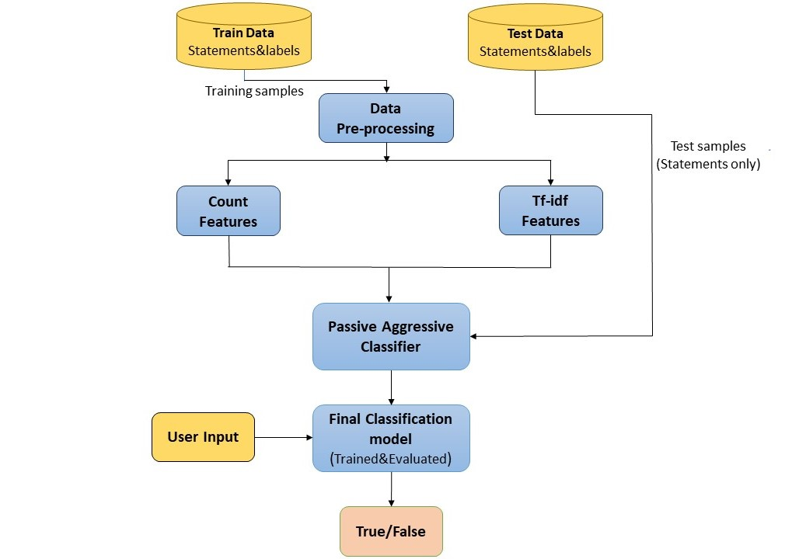

# Disinformation Detection System using Machine Learning Algorithm

## Table of Contents
- [Introduction](#introduction)
- [Problem Definition](#problem-definition)
- [Project Structure](#project-structure)
- [Datasets](#datasets)
- [Model Name](#model-name)
- [Images](#images)
- [Prerequisites](#prerequisites)
- [Getting Started](#getting-started)

## Introduction
This repository contains a comprehensive project for detecting **disinformation** using machine learning techniques and natural language processing methods. The project includes data analysis, model training, and a Flask web application for real-time detection. The system classifies news articles as either **true** or **false information** based on their content.

## Problem Definition
The goal is to develop a machine learning system that identifies sources consistently spreading **disinformation**. By analyzing multiple articles from the same source, the model learns to classify future content from that source more reliably. This source-based strategy improves classification tolerance by using multiple data points.

The system is particularly useful for social media platforms that want to assign visibility scores to content. Stories likely to be **false** can be made less visible to limit the spread of **disinformation**.

## Project Structure
The repository includes the following:

- **Images/**: Diagrams and charts (Process Flow diagram, confusion matrix, etc.)
- **dataset/**: Contains the training and test datasets.
- **static/**: Static files (CSS, JS) for the web app.
- **templates/**: HTML templates for the Flask web interface.
- **Disinformation_Detector-PA.ipynb**: Jupyter Notebook for data exploration and model training.
- **app.py**: Flask application for live detection.
- **model.pkl**: Pre-trained Passive Aggressive Classifier model.
- **vector.pkl**: Pre-trained TF-IDF vectorizer for text data.

## Datasets 

### train.csv
Contains labeled data for training:
- `id`: Unique ID of article
- `title`: Article title
- `text`: Main content of the article
- `label`: Classification label
  - `1`: False information
  - `0`: True information

### test.csv
Same structure as `train.csv` but without the `label` column.

## Model Name

**Passive Aggressive Classifier**

### Model Description
A fast, online-learning classifier ideal for binary classification. The algorithm adapts dynamically to streaming data, making it effective for real-time disinformation detection.

### Model Accuracy
Achieved **96% accuracy** on evaluation data, indicating strong performance in distinguishing between **true** and **false information**.

## Images

- **Process Flow Diagram**  
  

- **Confusion Matrix**  
  

## Prerequisites

Ensure you have the following:
- Python 3.7 or above
- Dependencies from `requirements.txt`

## Getting Started

To run this project locally:

1. Clone the repository:
   ```bash
   git clone https://github.com/sailesh-prasad/Disinformation_Detection_System
   ```

2. Create a virtual environment (optional but recommended):
   ```bash
   python -m venv my_env
   ```

3. Activate the virtual environment:
   ```bash
   # On Windows
   .\my_env\Scripts\Activate.ps1
   # On macOS and Linux
   source my_env/bin/activate
   ```

4. Install project dependencies:
   ```bash
   pip install -r requirements.txt
   ```

5. Run the web application:
   ```bash
   python app.py
   ```

Access the application in your web browser by navigating to `http://localhost:5000`.

## Project Contributors

- **Prasanna Raghav R** (820421104046)  
- **Ridhan Kishore R** (820421104053)  
- **Sai Krishnan T S** (820421104058)  
- **Sailesh Prasad R S** (820421104059)
